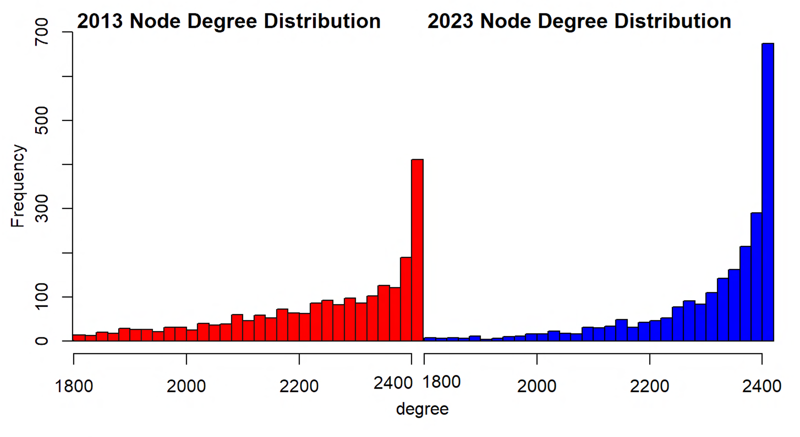
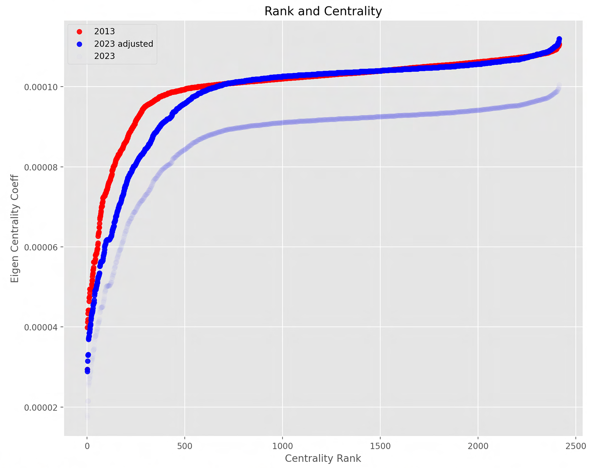

---
---
```{r setup, include=FALSE} 
knitr::opts_chunk$set(warning = FALSE, message = FALSE) 
```

<div style="float: left; padding-right: 10px;">
  
</div>

<strong style="font-size: 1.2em;">Introduction</strong>

Unlike other social networks where users follow friends or influencers, Reddit stands out by fostering engagement in specialized communities called subreddits, each centered around a specific topic. While platforms like Facebook and Twitter have been criticized for creating isolated echo chambers, it\'s unclear if Reddit shares the same trend. Despite having distinct communities with strong opinions, the interconnected nature of subreddits might prevent the formation of isolated echo chambers. This study aims to explore the interconnectivity between subreddits on Reddit, identifying clusters formed by shared users. To understand the evolution, we use a dataset from 2013, scraping the top posts of the top subreddits. With Reddit\'s substantial growth since then, reaching 500 million monthly users, we investigate how this growth has influenced subreddit interconnectivity.
```{r echo=FALSE}
library(htmltools)
HTML('<div style="display: flex; flex-direction: row; justify-content: space-between; align-items: flex-start;">
  <p>
    <strong style="font-size: 1.2em;">Basic Graph Theory</strong><br>
    To the right is a basic graph with labels. Each one of the circles represents nodes, and each of the lines signifies edges—relationships between two nodes. In this project, all graphs are unidirectional, meaning there is no distinction in the relationship going from A to B versus going from B to A. These graphs are also weighted, indicating that each edge or connection is not equal. Higher values signify a closer connection between the two nodes, a relationship also visually represented by the proximity of the nodes on the graph.


  </p>
  <div style="flex-shrink: 0; padding-left: 20px;">
    
  </div>
</div>')

```

In addition to the concepts mentioned, Clustering refers to nodes closely related to each other but relatively distant from the rest of the graph. These tightly knit groups form their own communities called clusters. These clusters have nothing to do with any information about the node other than how it is connected in the graph. Clustering does not assign group names or any explanation to the cluster's purpose or reasoning for grouping that is up for interpretation. In the example graph, nodes A, B, and C form one cluster, while nodes D, E, and F constitute another. This clustering is evident as they are connected by low-weight edges (weight of 1), indicating weaker connections between clusters compared to the stronger connections within each cluster.

eigenvector centrality is another essential term, it is a significant metric in graph theory. Eigenvector centrality measures the influence of a node in a network, considering both the node's direct connections and the connections of its neighbors. In simpler terms, a node is considered more central if it is connected to other nodes that are themselves well-connected. This metric plays a pivotal role in identifying key nodes within a network, highlighting their importance in information flow and overall connectivity.Understanding these concepts lays the foundation for comprehending more advanced graph theory principles, with eigenvector centrality proving particularly valuable in assessing the significance of individual nodes in the network.

```{r echo=FALSE}
library(htmltools)
HTML('<div style="display: flex; flex-direction: row; justify-content: space-between; align-items: flex-start;">
  <div style="flex-shrink: 0; padding-right: 20px;">
    
  </div>
  <p>
    <strong style="font-size: 1.2em;">Methodology: Scraping & Constructing the Graph</strong><br>
    In 2013, data from 2,500 subreddits was collected using a tool called praw in Python, I collected information on the top 1,000 posts from each subreddit, including post text, author details, links, and post IDs. For every post, I also recorded all comments, replies, the author\'s information, and comment karma. I created a log of each user\'s total comment karma on a specific subreddit.

From this information, I constructed an edgelist, mapping connections between users who commented on the top 1,000 posts. In the 2023 dataset, which included 67 million users out of Reddit\'s 500 million monthly user base, 2,416 subreddits were accessible due to some being quarantined.


  </p>
</div>')
```

<strong style="font-size: 1.2em;">Overall Clustered Data of Subreddits 2023</strong>

```{r echo=FALSE}
library(leaflet)
library(shiny)
library(leafem)

leaflet() %>%
  setView(lng = -74.175995, lat = 40.7430785, zoom = 13) %>%
  #addMarkers(lng = -74.175995, lat = 40.7430785, popup = "Bottom Right Corner") %>%
  htmlwidgets::onRender("
      function(el, x) {
        console.log(this);
        var myMap = this;
        var imageUrl = 'assets/bestyet.png';
        var imageBounds = [[40.712216, -74.22655], [40.773941, -74.12544]];

        L.imageOverlay(imageUrl, imageBounds).addTo(myMap);
      }
      ")
```

Among the various Reddit communities, I identified a distinct cluster that included subreddits like basketball, baseball, NFL, NBA, and golf. This cluster was somewhat separate but still connected to the main Reddit component. Interestingly, mainstream topics were not as central as gaming, anime, or technology, suggesting a significant group of Redditors dedicated to sports but not engaging with other topics. Notably, FIFA and European soccer subreddits were more connected to the broader Reddit community.


```{r echo=FALSE}
library(htmltools)
HTML('<div style="display: flex; flex-direction: row; justify-content: space-between; align-items: flex-start;">
  <p>
    <strong style="font-size: 1.2em;">Degree</strong><br>
    
In the realm of graph theory, the degree of a vertex in an undirected graph signifies the number of edges linked to that vertex. Put simply, it quantifies the edges associated with a specific node. In the context of this project, this translates to determining the number of distinct subreddits that share users in common. I calculated the degree for each subreddit, systematically arranged them from low to high, and visualized the results through a histogram, for comparative analysis of the degree distribution in 2013 and 2023. The discernible trend in the histogram reveals a substantial increase in inter-subreddit connections over the years, indicating a heightened level of interconnectedness among subreddits.
  </p>
  <div style="flex-shrink: 0; padding-left: 20px;">
    
  </div>
</div>')

```

```{r echo=FALSE}
library(htmltools)
HTML('<div style="display: flex; flex-direction: row; justify-content: space-between; align-items: flex-start;">
  <div style="flex-shrink: 0; padding-right: 20px;">
    
  </div>
  <p>
    <strong style="font-size: 1.2em;">Centrality</strong><br>
    
I plotted the eigen centrality of each node over the years, finding that the 2023 subreddits are more central to each other. Compared to the 2013 plot, there is a sharper decline in nodes with high centrality, indicating more well-connected central subreddits today. Importantly, this increase in centralization is not solely linked to a subreddit\'s popularity. For instance, despite Apple\'s increased popularity, its community is now more isolated and less central than it was in 2013 relative to other technology subreddits.
  </p>
</div>')
```

<div style="float: left; padding-right: 300px;">
  
</div>

<strong style="font-size: 1.2em;">Negative Interaction Graphs</strong>

Previous graphs measured interactions based on the number of users commenting on different subreddits, considering all comments with karma greater than 10 or less than -10. This filter excludes minimal interactions, focusing on more significant user engagements.

Now, let's explore negative interactions. Each user maintains a list of subreddits they've commented on, along with the total karma their comments received for each subreddit. Subreddits are then categorized as those where the user is negatively received (karma ≤ -10) and those where they are positively received (karma ≥ 10). Edges are drawn between negative and positive subreddits, or existing edges are strengthened by one.

The resulting graph is intriguing, revealing clusters not immediately apparent. The goal is to identify the odd subreddit within a cluster that wouldn't typically be grouped with others. To achieve this, simulations using the Louvain clustering methodology are employed. This method efficiently analyzes complex networks, although the resolution parameter introduces some randomness, leading to slightly different clusters in each simulation.

To mitigate bias, multiple simulations with varying resolution values are conducted. The frequency of any two subreddits appearing in the same cluster across all simulations is recorded. If a pair occurs less than 33% of the time, the subreddits involved are labeled anomalies, represented as fully opaque nodes among the normal, semi-transparent clusters.

<div style="float: left; padding-right: 10px;">
  
</div>

```{r echo=FALSE}
library(leaflet)
library(shiny)
library(leafem)

leaflet() %>%
  setView(lng = -74.175995, lat = 40.7430785, zoom = 13) %>%
  #addMarkers(lng = -74.175995, lat = 40.7430785, popup = "Bottom Right Corner") %>%
  htmlwidgets::onRender("
      function(el, x) {
        console.log(this);
        var myMap = this;
        var imageUrl = 'assets/basictest6.jpg';
        var imageBounds = [[40.712216, -74.22655], [40.773941, -74.12544]];

        L.imageOverlay(imageUrl, imageBounds).addTo(myMap);
      }
      ")
```